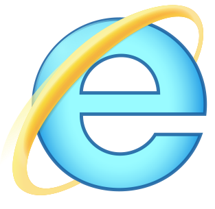

<div align="center">
  
</div>

<p align="center">
  
  
  
  
  
  
</p>

<p align="center">
  <a href="https://stylized.dev">Docs</a>
  ·
  <a href="#🚀-installation">Installation</a>
  ·
  <a href="https://github.com/stylizedjs/stylized/graphs/contributors">Stylizers</a>
</p>

<p align="center">
  <a href="#"
    ></a>
   
  <a
    href="#"
    ></a>
   
</p>

## ✨ Features

- ▶️ Easy start — just download, import and start using
- 🎨 Easy customization and adaptation for your project
- 🤝 High compatibility with libraries and frameworks
- 📦 Complete package of Stylized components
- 🌍 Multilingual documentation
- 💾 Extremely lightweight

## ✔️ Prerequisites

- Node.js
- NPM

## 📦 Installation

```bash
npm install stylizedjs
```

## 🔨 Usage

## 🤝 Contributing

## ❔ FAQ

<details>
  <summary> Why another UI library?</summary>

Stylized was created to offer a lightweight, beautiful and simple-to-use UI library.

</details>
<details>
  <summary> How Stylized behaves in old browsers?</summary>
  <table>
    <tr>
      <th>
        
      </th>
      <th>
        
      </th>
      <th>
            
      </th>
      <th>
        
      </th>
      <th>
            
      </th>
      <th>
            
      </th>
    </tr>
    <tr>
      <td>✅</td>
      <td>✅</td>
      <td>✅</td>
      <td>✅</td>
      <td>✅</td>
      <td>NFW</td>
    </tr>
  </table>
</details>
<details>
  <summary> I don't know how to code in CSS. Is there any other way to contribute?</summary>

Yes! There are a lot of ways to contribute with Stylized. You can **star** the repository, share it with friends, <a href="https://mynano.link/nano_1juij9z3o3cj55aokgj9u8geb6u4nzwjo97pyutwsspx3obtuoyt4osp9mye">boost our project donating with Nano</a> or help with translations in the documentation.

</details>
<details>
  <summary> Can I use it in a project of my company?</summary>

Yes, you can. However, there is no responsibility or warranty on the part of the collaborators of the project or the creator (<a href="https://github.com/gdcmarinho">@gdcmarinho</a>). If you need more informations about it, [read the license](./LICENSE).

</details>
<details>
  <summary> How to request the creation of a new component?</summary>

It's possible to open an issue using the label <a href="https://github.com/stylizedjs/stylized/labels/enhancement">enhancement</a>. Enter as much information as possible and, if possible, give examples.

</details>

## 📝 License

This project is licensed under the
[MIT license](./LICENSE)

✨ Designed by Gabriel Marinho. [Follow me on GitHub!](https://github.com/gdcmarinho)
